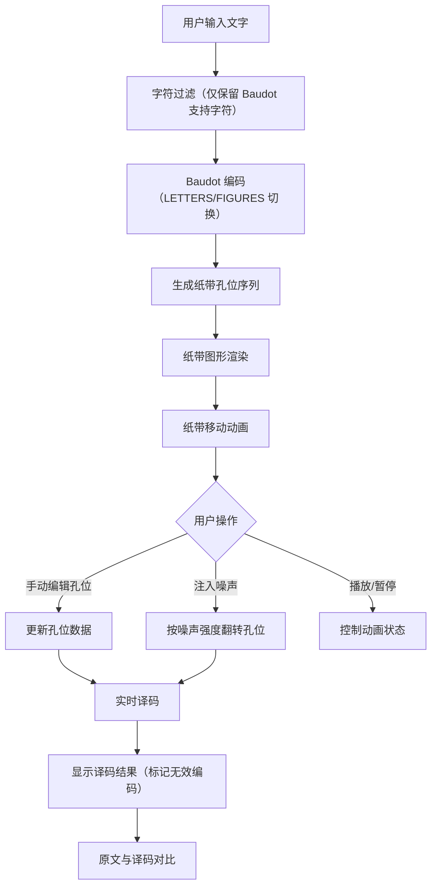

## 1. 产品概述

本项目是一个基于 Web 的电传打字机纸带编码模拟器，用于教育和演示早期电传通信中 Baudot（ITA2）编码的纸带打孔、传输和译码过程。用户输入文字后，系统自动生成 Baudot 编码孔位并以动画展示纸带移动；用户可以手动修改孔位、注入传输噪声，观察损坏纸带的译码结果。

- 目标用户：通信工程学习者、计算机历史爱好者、编码理论教学场景
- 核心价值：直观展示 Baudot 编码/译码全流程，通过交互式操作理解传输噪声对信息完整性的影响

## 2. 核心功能

### 2.1 功能模块

1. **编码面板**：文本输入区、Baudot 编码序列展示、字符过滤提示
2. **纸带视图**：可视化纸带打孔图形、纸带移动动画、孔位手动编辑
3. **传输模拟**：噪声强度调节、噪声注入、播放/暂停控制
4. **译码面板**：译码结果展示、无效编码标记、原文与译码对比

### 2.2 页面详情

| 页面名称 | 模块名称 | 功能描述 |
|---------|---------|---------|
| 主页面 | 编码面板 | 输入文字，自动过滤不支持的字符，实时显示 Baudot 编码序列 |
| 主页面 | 纸带视图 | 可视化纸带打孔图形，5 列孔位 + 1 列齿孔，动画展示纸带移动 |
| 主页面 | 孔位编辑 | 点击孔位切换开/关状态，实时更新译码结果 |
| 主页面 | 传输控制 | 噪声强度滑块（0%~100%），注入噪声按钮，播放/暂停/重置按钮 |
| 主页面 | 译码面板 | 显示译码文本，无效编码以红色标记，与原文对比高亮差异 |

## 3. 核心流程

用户输入文字 → 过滤非法字符 → Baudot 编码 → 生成纸带孔位 → 动画展示纸带移动 → 用户可手动编辑孔位 → 用户可注入噪声 → 实时译码 → 显示结果（标记无效编码和差异）

## 4. 用户界面设计

### 4.1 设计风格

- **主题**：复古工业风 / 电传打字机美学
- **主色调**：深褐色纸带底色 `#1a1410`，象牙白纸张 `#f5f0e8`，黑色孔位 `#1a1a1a`，琥珀色强调 `#d4a030`
- **辅助色**：暗铜色 `#8b6914`，深灰色金属 `#4a4a4a`，墨绿色指示灯 `#2d8b46`，红色错误标记 `#c0392b`
- **字体**：等宽字体（IBM Plex Mono / Courier New），标题使用粗体工业风字体
- **布局**：纵向四面板布局，从上到下依次为编码面板、纸带视图、传输控制、译码面板
- **按钮风格**：拟物化金属质感按钮，带凹凸阴影效果
- **图标风格**：线性工业图标

### 4.2 页面设计概述

| 页面名称 | 模块名称 | UI 元素 |
|---------|---------|---------|
| 主页面 | 编码面板 | 文本输入框（多行），字符计数，编码序列表格（字符→编码→二进制） |
| 主页面 | 纸带视图 | 横向滚动画布，纸带底纹，圆形孔位（开/关），齿孔行，当前位置指示器 |
| 主页面 | 孔位编辑 | 点击孔位切换，悬停高亮，编辑状态提示 |
| 主页面 | 传输控制 | 播放/暂停按钮，速度滑块，噪声强度滑块，注入噪声按钮，重置按钮 |
| 主页面 | 译码面板 | 译码文本显示，无效编码红色标记，差异高亮对比 |

### 4.3 响应式设计

- 桌面端优先，最小宽度 1024px
- 纸带视图区域可横向滚动
- 面板可折叠以适应较小屏幕

## 5. 技术约束

- 仅允许输入 Baudot（ITA2）编码表支持的字符（A-Z、0-9、常用标点和控制字符）
- 每列孔位数量固定为 5 个数据位 + 1 个齿孔位
- 修改孔位后译码结果必须实时更新
- 无效编码（如未定义的 5 位组合）需用 `■` 标记并红色高亮
- 噪声强度范围 0%~100%，超出范围自动钳位
- 播放暂停后继续时必须保持原有纸带位置
- Baudot 编码需正确处理 LETTERS/FIGURES 换档
