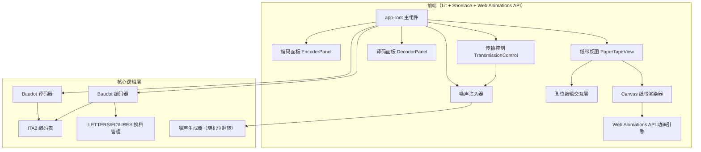

## 1. 架构设计



## 2. 技术说明

- **前端框架**：Lit 3.x + TypeScript（Web Components）
- **UI 组件库**：Shoelace（@shoelace-style/shoelace）用于输入框、滑块、按钮等标准 UI 组件
- **动画引擎**：Web Animations API（Element.animate()）用于纸带移动动画
- **纸带渲染**：Canvas 2D API 用于绘制纸带图形（孔位、齿孔、底纹）
- **构建工具**：Vite + TypeScript
- **样式方案**：CSS 自定义属性 + Lit 的 CSS 结果绑定（无 Tailwind，因为 Lit 组件使用 Shadow DOM）
- **状态管理**：组件间通过 Lit 的属性绑定和自定义事件通信
- **后端**：无（纯前端项目）

## 3. 路由定义

| 路由 | 用途 |
|------|------|
| / | 主页面，包含所有功能面板 |

本项目为单页应用，无需多路由。

## 4. 核心数据结构

### 4.1 Baudot 编码表（ITA2）

```typescript
interface BaudotCode {
  bits: [boolean, boolean, boolean, boolean, boolean];
  lettersChar: string | null;
  figuresChar: string | null;
}

type ShiftState = 'LETTERS' | 'FIGURES';

interface EncodedColumn {
  bits: [boolean, boolean, boolean, boolean, boolean];
  originalChar: string;
  shiftState: ShiftState;
  isShiftCode: boolean;
  isValid: boolean;
  decodedChar: string | null;
}
```

### 4.2 纸带数据

```typescript
interface PaperTapeData {
  columns: EncodedColumn[];
  noiseLevel: number;
  currentPosition: number;
  isPlaying: boolean;
  playbackSpeed: number;
}
```

### 4.3 组件通信事件

| 事件名 | 数据 | 方向 |
|--------|------|------|
| `text-encoded` | `EncodedColumn[]` | EncoderPanel → AppRoot → PaperTapeView/DecoderPanel |
| `bits-changed` | `{ index: number, bits: [boolean, boolean, boolean, boolean, boolean] }` | PaperTapeView → AppRoot → DecoderPanel |
| `noise-injected` | `EncodedColumn[]` | TransmissionControl → AppRoot → PaperTapeView/DecoderPanel |
| `playback-control` | `{ action: 'play' | 'pause' | 'reset', position?: number }` | TransmissionControl → AppRoot → PaperTapeView |

## 5. 项目目录结构

```
src/
├── components/
│   ├── app-root.ts              # 主应用组件
│   ├── encoder-panel.ts         # 编码面板
│   ├── paper-tape-view.ts       # 纸带视图（Canvas + 动画）
│   ├── transmission-control.ts  # 传输控制面板
│   └── decoder-panel.ts         # 译码面板
├── core/
│   ├── baudot-encoder.ts        # Baudot 编码器
│   ├── baudot-decoder.ts        # Baudot 译码器
│   ├── baudot-table.ts          # ITA2 编码表定义
│   └── noise-generator.ts       # 噪声生成器
├── types.ts                     # 类型定义
├── styles.ts                    # 共享样式
└── index.ts                     # 入口文件
```

## 6. 关键实现细节

### 6.1 Baudot 编码（ITA2）

ITA2 使用 5 位编码，分为 LETTERS 和 FIGURES 两个字符集：
- 字母 A-Z（LETTERS 档）
- 数字 0-9 和常用标点（FIGURES 档）
- 控制码：LETTERS SHIFT（11111）、FIGURES SHIFT（11011）、空格（00100）、回车（01000）、换行（00010）

编码时需自动插入换档码，保持当前档位状态。

### 6.2 纸带渲染

- 使用 Canvas 2D API 绘制纸带
- 纸带底色为浅黄色（`#f5f0e8`），带纹理
- 孔位为圆形，开孔显示深色背景，闭孔显示实心
- 中间齿孔行（sprocket hole）始终存在
- 每列 5 个数据位 + 1 个齿孔

### 6.3 纸带动画

- 使用 Web Animations API（`Element.animate()`）实现纸带水平滚动
- 动画属性：`transform: translateX()`
- 播放/暂停通过 `animation.pause()` / `animation.play()` 控制
- 暂停后继续时调用 `animation.play()` 保持当前位置
- 速度通过 `animation.playbackRate` 动态调整

### 6.4 噪声注入

- 根据噪声强度（0~1），对每个数据位的每一位独立以该概率翻转
- 噪声强度钳位到 [0, 1] 范围
- 注入后实时更新译码结果

### 6.5 无效编码标记

- 译码时遇到未定义的 5 位组合，标记为 `■` 并红色高亮
- LETTERS/FIGURES 档位不匹配时也需提示
